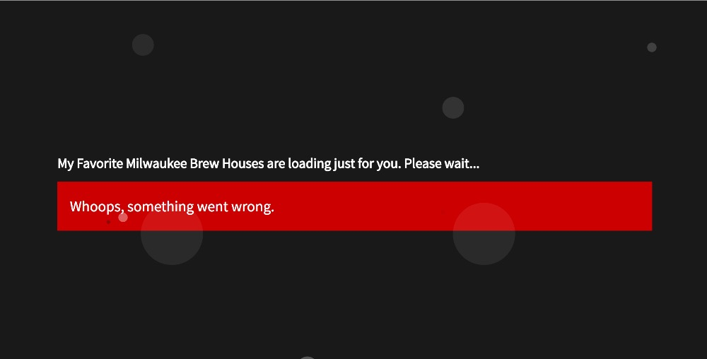
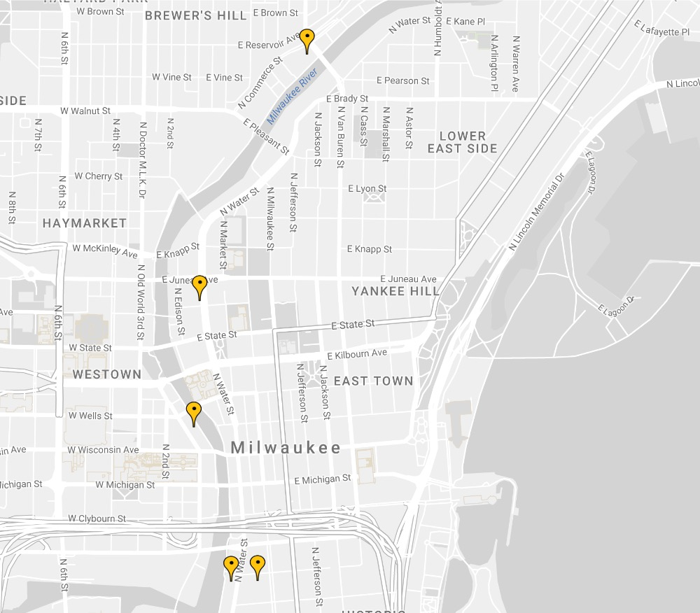
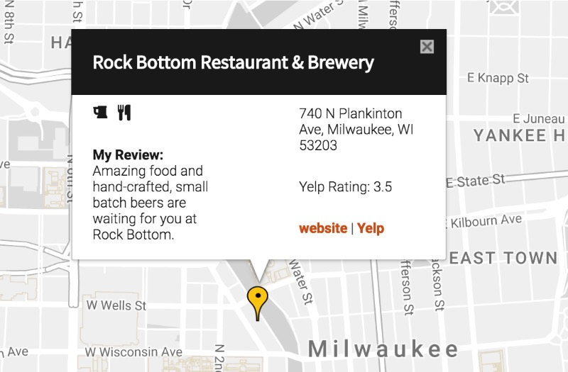
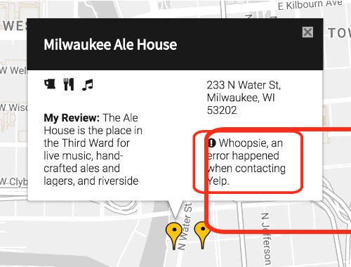
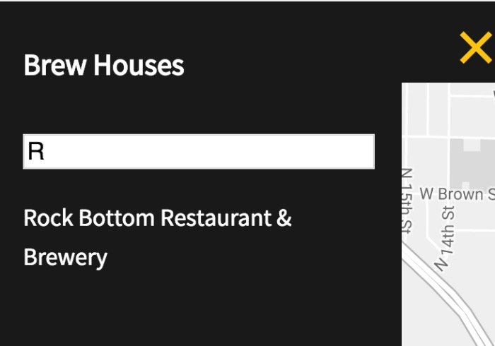

# My Favorite Milwaukee Brew Houses

This NodeJS app provides a minimalistic Google Map of all my favorite brew houses in Milwaukee, WI USA.  I even give a personal review and recommendation just to tempt you into trying my favorites.

You can view the online version of this app on Heroku at [https://milwaukee-brews.herokuapp.com/](https://milwaukee-brews.herokuapp.com/).

## How to Run this App

You can run this app in your browser by going to [Heroku]((https://milwaukee-brews.herokuapp.com/)).  Or if you prefer to install it locally on your computer, then go to the [next section](#cloning-to-your-machine) and following the steps to clone it.

### Cloning to Your Machine

Follow these steps to clone this repository onto your machine.

1. Open up terminal or Git Bash.
2. Navigate to where you want to clone it.
3. Type: `git clone https://github.com/hellofromtonya/milwaukee-brews.git`.
4. Type: `cd milwaukee-brews`
5. Make sure you have node (at least version 8.4.0) and npm (at least version 5.3.0) installed.

    - 5.a. To check, type: `node -v` and then `npm -v`.
    - 5.b. If not installed, go to [nodejs.org](https://docs.npmjs.com/getting-started/installing-node) and then follow the steps.
    
Once the above is completed and you have both node and npm installed on your machine, you are ready to run this application.
    
### Running the App Locally

Make sure you've followed the steps above to clone the repository to your local machine and have both node and npm installed.  See the [above section](#cloning-to-your-machine) for more details.  Ready to start it up?  Great follow these steps:

1. Open terminal or Git Bash.  If you are using WebStorm, open terminal in the IDE.
2. Navigate to where the repository lives on your machine.
3. Then type: `npm start`.  This starts up the server.
4. Read the port that npm started the Node app on.  For example, it may say:

>Node app is running on port 5000

That means you run it with this URL: `http://localhost:5000/`, i.e. where `5000` is the port that Node reports back to you.

5. Open your favorite browser.
6. Go to the app's URL by typing `http://localhost:5000/` (or whatever port is running on your machine) into the browser's URL window.
7.  The app then loads into your browser on localhost.  Go to the [Running the App in the Browser](#running-the-app-in-the-browser) section.

## Running the App in the Browser

The app starts with a splash screen and beer bubbles.  This splash screen stays visible until 1 second after Google Maps API loads up.

But if for some reason Google Maps is not available or reports an error, then a red error box appears to alert you:

If everything is happy, then the Milwaukee Map appears.  Notice that it's a minimalistic design.  

The yellow markers indicate the location of my favorite brew houses.  

### How to Get Information about a Location

There are 2 ways to get information about a brew house:

1. Click on the yellow map marker.
2. Click on the menu icon in the upper left hand corner of the screen to open the list of brew houses.  Then click on one of the listings.

After clicking, an informational popup appears like this one:

The popup gives you the following information about this brew house:

- Name of the brew house
- Icons to let you know what's there including:
    - beer (of course)
    - restaurant
    - live music
- My personal review
- It's address
- Yelp's rating
- Links to the brew house's website and its Yelp page

If an error happens when contacting Yelp, you'll see an error message on the popup as noted in the red box in this image:

### How to Close the Popup

Clicking on the X in the upper right hand corner of the popup closes it.

### Filtering Locations

The app includes a filtering option. Click on the main menu icon in the upper left hand corner of the screen.  A listing of brew houses slides out.

In the white input box, you can type the name of the brew house you are looking for.  The list is dynamically filtered for you.  For example, if you type `R`, all brew houses that begin with an "R" are displayed, like this:

Notice that the map also displays only the matching marker(s).

Click on the brew house name you want.  The information popup window appears for you.

## How it was built

This app is built with:

- [Google Maps API](https://developers.google.com/maps/)
- [KnockoutJS](http://knockoutjs.com/)
- [Yelp Fusion v3 API](https://www.yelp.com/developers/documentation/v3)
- [Node.js](https://nodejs.org/en/)
- [Express](https://expressjs.com/)
- [Font Awesome](http://fontawesome.io/)
- [CSS Normalize](http://necolas.github.io/normalize.css/)
- JavaScript ES6 OOP
- Sass

### Why Node?  

Great question. Yelp's API switched to OAuth 2, which requires a server to act as the proxy between the front-end and Yelp. Okay, we can do that.  So I built a very simple Node web server.

For the Yelp Fusion API, I used the [Yelp Fusion GitHub](https://github.com/Yelp/yelp-fusion/blob/master/fusion/node/sample.js) repository as a baseline and then adapted it for my needs. 

### Why KnockoutJS

Why not? It's lean and simple.  Plus, it was fun to give it a go.

## Customizing It

So you want to customize this app for yourself.  To start, you'll want to either [clone](#cloning-to-your-machine) or fork and then clone.  Follow the clone steps above to get the repository onto your machine.

Once it's on your local machine, follow these steps:

1. Open up terminal or Git Bash.
2. Navigate to where you cloned the app onto your machine.
3. Type: `npm install`.  You'll need a suite of node modules for development work.  Running `npm install` installs the production (i.e. `dependencies`) and `devDependencies` that are listed in the `package.json` file.
4. Make sure you are running Node version 8.4.0 and npm 5.3.0.  If no, you can change the versions or change the `engines` section in the `package.json` file to match your machine.
5. The source front-end JavaScript files are located in `src/js` folder.  Make your changes there.
6. This app uses Sass for the styles.  You can find the Sass files in `src/sass`.
7. When you're done making changes, it's time to optimize the scrips and styles.  Do the following:

    - 7.1. Navigate to the root of the project.
    - 7.2. Open the `gulpfile.js` file and uptick the version number.  That number is used for the folder name in `public`.
    - 7.3. Type: `gulp lint`.  The scripts are linted using ESLint and the Udacity configuration.
    - 7.4. Fix any problems that the linter tells you.
    - 7.5. Once fixed, then type: `gulp scripts`.  The scripts in the `src/js` folder are concatenated, converted to ES2015 via Babel, and then stored in a single file `public/YOUR-VERSION/app.js`.  Then that file is minified.
    - 7.6. Type: `gulp styles`.  The Sass partials are processed, stored in `public/YOUR-VERSION/style.css`.  Then that file is minified.

8. Open up `views/index.ejs`.  Change the `path-to` for the `style.min.css` and `app.min.js` files to the version number you created.        
 
Rinse and repeat until you are happy with your creation.

Once you're done and want to push it to production or back to your repository, you'll need to do the following:

1. Delete the `node_modules` folder. 
2. Type: `npm install --production`.  Only the server dependencies are loaded and not the development dependencies.
3. When it's done, you can push it.

## Credits

- The Yelp Fusion API code is an adaption of the [sample provided by Yelp](https://github.com/Yelp/yelp-fusion/blob/master/fusion/node/sample.js).
- The Google Map styles are provided by [Snazzy Maps](https://snazzymaps.com/style/132/light-gray).
- The sidebar sliding animation is an adaption of ["Off-Canvas Navigation Transitions"](https://tympanus.net/codrops/2013/08/28/transitions-for-off-canvas-navigations/) article by Mary Lou via Codrops.
- The bubbles on the Splash page are an adaption inspired from [Jacob Gibellini's pen](https://codepen.io/jacobgibellini/pen/zrrWWQ?q=boilin%27%20bubbles&limit=all&order=popularity&depth=everything&show_forks=false).

## Disclaimer

I built this app as part of the [Udacity Front-End Web Developer Nanodegree](https://www.udacity.com/course/front-end-web-developer-nanodegree--nd001) program.  You may notice an unused file `index.html` in this app.  This file is just there to make Udacity's review team happy.  It doesn't do anything, as Node loads the index file that's in `views/index.ejs`.

Cheers and &lt;happy coding&gt;,    
Tonya